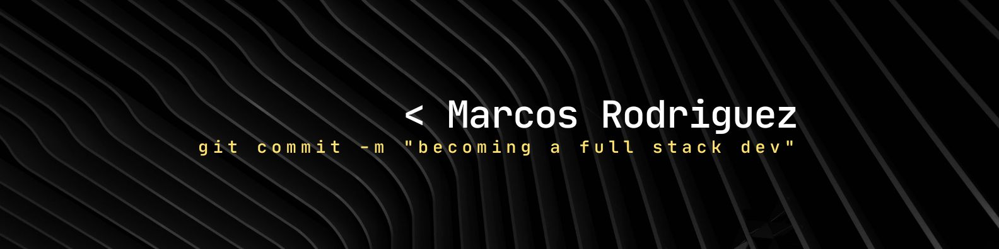

 

- Hi! I'm Marcos Rodriguez, and here I'll be sharing my projects and progress toward my ultimate goal in this wonderful world as a full-stack developer

## 👋 About Me

- 🇪🇸 Originally from Spain, currently living in **Finland** since October 2025
- 🎓 Full Stack Developer **student** at [**Conquer Blocks**](https://github.com/ConquerBlocks) 
- 🔭 Currently working through the **Python (Advanced)** and **Git & GitHub** modules
- 🎯 **Goal:** become a Full Stack Developer within the next **6–12 months** and start building real-world projects along the way
- 🌱 Learning in public — this profile will evolve as I do
- 💬 Ask me about my progress, I'm always happy to talk about what I'm learning
- 📫 Reach me at **rodriguezmarcos.fi@gmail.com**

> *"I'm not there yet, but I'm not where I started either."*

 

## 🛠️ Tech Stack

**Currently learning**

  

**Coming up on the roadmap**

 

## 🏆 Certifications — Conquer Blocks

| Certificate | Status |
|---|---|
| Python | ✅ Completed |
| Git & GitHub | 🔄 In progress |

> 📎 Certificates are issued by ConquerX / Conquer Blocks, signed by Bienvenido Sáez, Educational Director.

 

## 📊 GitHub Stats

 

## 🤝 Connect with Me

 

