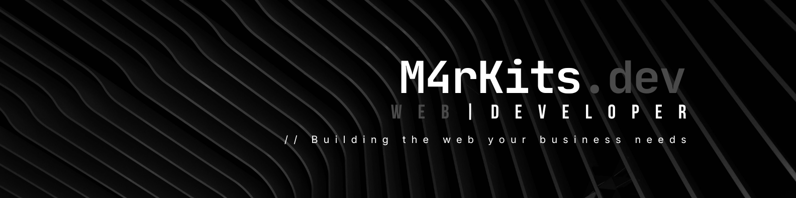

  
  

Hi! I'm Marcos Rodriguez, and here I'll be sharing my projects and progress toward my ultimate goal in this wonderful world as a full-stack developer.

👋 About Me
🇪🇸 Originally from Spain, currently living in Finland since October 2025
🎓 Full Stack Developer student at Conquer Blocks
🔭 Currently working through the Python (Advanced) and SQL modules
🎯 Goal: become a Full Stack Developer within the next 6–12 months and start building real-world projects along the way
💼 Building M4rKitS.dev, my freelance brand — websites and apps for small businesses and startups
🌱 Learning in public — this profile will evolve as I do
💬 Ask me about my progress, I'm always happy to talk about what I'm learning
📫 Reach me at contact@m4rkits.dev

"I'm not there yet, but I'm not where I started either."

 
⚙️ How I Work

I combine my formal training with AI-assisted development tools — mainly Google Antigravity — to design, build, and ship real products faster. I own the architecture decisions, the product calls, and the debugging; the tools help me execute. It's how I built everything you'll find below.

 
🧭 My Roadmap to Full Stack Developer

 <table> <tr><td>

Foundations

 Git & GitHub
 Python — Basics
 Python — Advanced (in progress)
 SQL

Frontend

 HTML & CSS
 JavaScript
 ReactJS
 Vue.js
 Angular
 Astro
</td><td>

Backend & Data

 Django
 Node.js
 Java
 Rust
 Go

Extra / Specializations

 SEO
 WordPress
 Streamlit
 AI · Google Antigravity
 Automations & AI Agents
</td></tr> </table> 
  
🚀 Featured Projects

Project	Description	Stack
M4rkcal	Native iOS calorie & protein tracker with Apple Watch integration	SwiftUI · SwiftData · HealthKit
M4rKitS.dev	My personal freelance brand website	Cloudflare Pages · JS

  
🛠️ Tech Stack

Currently learning

  

Coming up on the roadmap

 
  
🏆 Certifications — Conquer Blocks

Certificate	Status
Python	✅ Completed
Git & GitHub	✅ Completed
Python Advanced	🔄 In progress

📎 Certificates are issued by ConquerX / Conquer Blocks, signed by Bienvenido Sáez, Educational Director.

 
📊 GitHub Stats

    
  
🤝 Connect with Me

    
   
